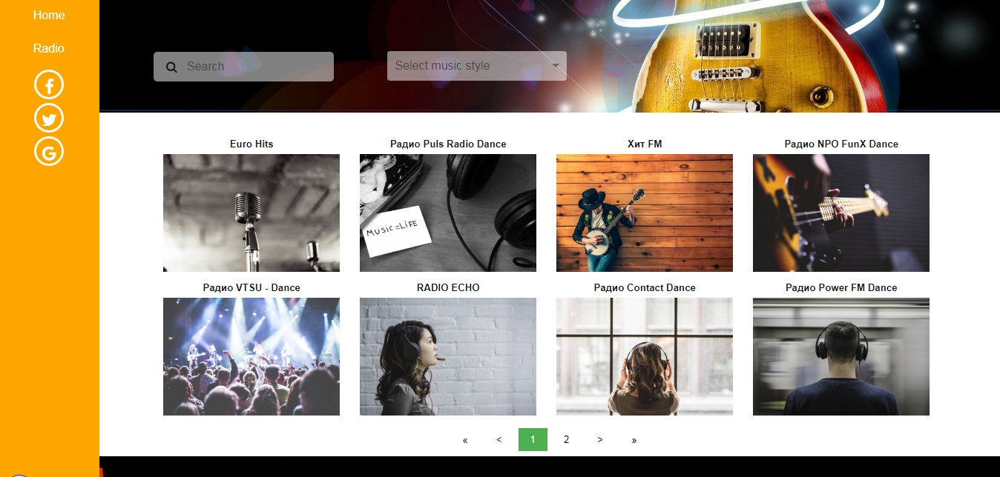

My Radio
=============

React application allowing you to listen to the radio. To add a radio, you need to change the file "server/data/radios.json".

>npm start

ReactJS application will be run on localhost:3000. When switching to localhost: 8080, the application files will be received using the server written on NodeJS

